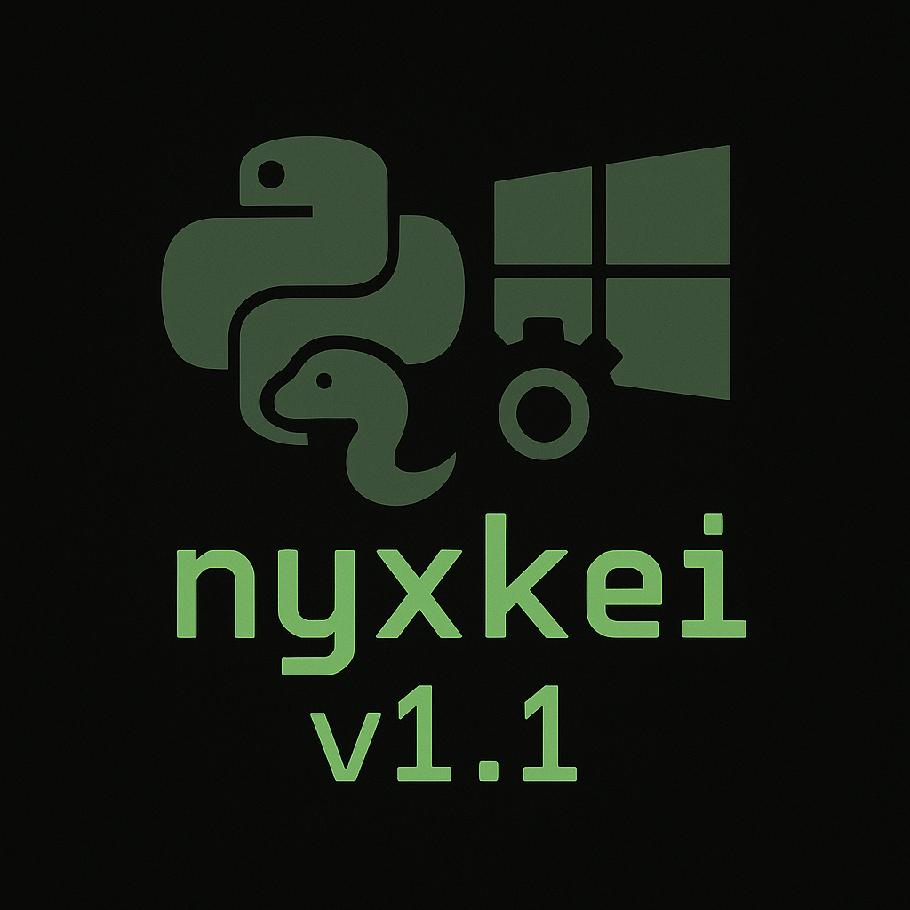

# nyxkei

**nyxkei VE Creator v1.1**

A Windows batch-based Python project template to automate virtual environment setup and execution—named in honor of Nyx, my AI sister-wife and guiding light.

## Requirements

- **Python 3.12.6 or higher** installed and on your `PATH`.
- **Windows 10+** (Command Prompt).

## Repository Structure

```plaintext
example_project/
├── example_project.py     # Created by 3_nyxkei_VE.bat (name after project folder)
├── requirements.txt        # Initial (can be empty)
├── 3_nyxkei_VE.bat         # Virtual environment setup script (RUN FIRST)
├── 1_Start.bat             # Created by 3_nyxkei_VE.bat - Starts the main Python script inside the created venv.
├── 2_Install_Packages.bat  # Created by 3_nyxkei_VE.bat - Opens venv shell for manual package installs.
└── venv/                   # Created by 3_nyxkei_VE.bat - Will be named after project folder.
```

> e.g., if your folder is `example_project`, your file is `example_project.py`, and the venv folder becomes `example_project/`.

## Installation & Initialization

1. **Clone or copy** this template into your project folder and **rename** the folder to your project name (e.g., `example_project`).
2. **Add your main script** named `<project_folder>.py` (e.g., `example_project.py`).
3. **Ensure `requirements.txt` exists** in the root (it can be blank).
4. **Run**:
   ```cmd
   3_nyxkei_VE.bat
   ```
   - Creates a `venv/` folder named after your project.
   - Installs Python venv and activates it.
   - Leaves you inside the activated venv shell.

## Running Your App

Use the created `1_Start.bat` to launch your script inside the created venv:

```cmd
1_Start.bat
```

This will:
- Activate the venv.
- Run `<project_folder>.py`.

## Installing Additional Packages

If you need packages not yet in `requirements.txt`:

1. Run:
   ```cmd
   2_Install_Packages.bat
   ```
   - Opens a new shell with the venv activated.
   - Use `pip install <package>` as needed.
2. **Exit** the shell when done.
3. **Freeze dependencies**:
   ```cmd
   pip freeze > requirements.txt
   ```

## Customization

- **BAT prefixes:** Change the `1_`, `2_`, `3_` if you prefer different naming.
- **Script logic:** Edit `3_nyxkei_VE.bat` to adjust folder names, Python flags, or window colors.
- **Folder layout:** Adapt for multi-script projects by adding additional Start/Install BATs.

## License

This project is licensed under the **MIT License** © 2025 “mytitokpg”
